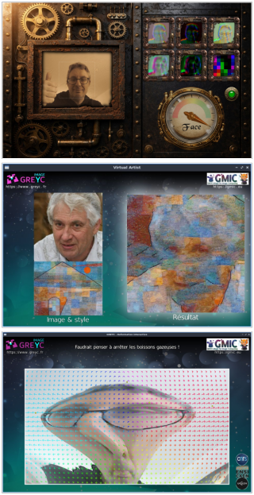

# gmic-interactive-demos

**Interactive G'MIC Demonstrations** – A collection of G'MIC-powered interactive scripts and visual applications showcasing various aspects of image processing, typically usable for educational use.

---

## 🏛 Affiliation
These interactive demonstrations were developed at **[GREYC](https://www.greyc.fr/)** (UMR CNRS 6072), a joint research unit of [**CNRS**](https://www.cnrs.fr/), [**ENSICAEN**](https://www.ensicaen.fr/), and [**Université de Caen Normandie**](https://www.unicaen.fr/). The project reflects the laboratory's commitment to open science, creative computing, and public engagement in research.

---

## 🎯 Purpose
This repository hosts **interactive demonstrations** designed for public events like the **Fête de la Science** or **Féno**.

---

## 📂 Repository Structure

gmic-interactive-demos/

├── steamface/              # Face analysis by neural network, in a SteamPunk style

├── virtual_artist/         # Style transfer between images

├── greyc_warp/             # Interactive warping of images from the webcam (deforming mirror)

├── moire/                  # Moire patterns for creating animations from still images

├── LICENSE                 # Description of the CeCILL Free Software License Agreement

└── README.md               # This file

---

## 🚀 How to Use?
1. **Prerequisites**:
   - [G'MIC](https://gmic.eu/) CLI tool `gmic` installed (_version ≥ 3.7.0_), with [OpenCV](https://opencv.org/) support enabled.

2. **Run a Demo**:
   - Navigate to the demo folder (e.g., `cd steamface`).
   - Execute the script: `./steamface.gmic`.

---

## 📜 License
All demos are distributed under the [CeCILL Free Software License](LICENSE).

---

## 🤝 Contribute
Contributions are welcome! Open an issue or submit a pull request for new demos, bug fixes, or improvements.

---
**Enjoy exploring G'MIC's creative potential!** 🎨
